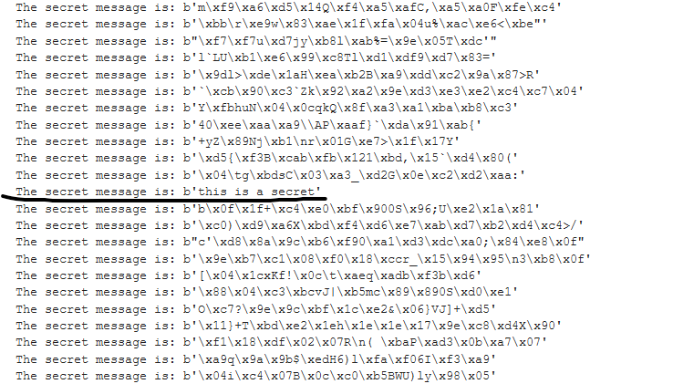

# Encoding, Hashing, and Encrypting
Explanations of all three, with examples of each in Python.


## Encoding
The process of transforming data such that it is recoverable by anyone without a key
Base 64 is a binary encoding schema that allows for turning unprintable binary data into ASCII text. Encoding makes the transmission of data possible for systems that can't speak unprintable characters, for example.
Below, you can update unprintable bytes to whatever string of characters you like, or you can use the example given.
``` python
import codecs
from base64 import b64encode, b64decode

unprintable_bytes = b"hello world \x81"
unprintable_bytes_hex = codecs.encode(unprintable_bytes, "hex")
unprintable_bytes_b64 = b64encode(unprintable_bytes)

print("unprintable_bytes is equal to: %s" % unprintable_bytes)
print("we can represent these as hex: %s" % unprintable_bytes_hex)
print("but base64 encoded it is represented as: %s" % unprintable_bytes_b64)
print("we can then decode the base64 representation: %s" % b64decode(unprintable_bytes_b64))
```
The result of the above executed is below:
```
unprintable_bytes is equal to: b'hello world \x81'
we can represent these as hex: b'68656c6c6f20776f726c642081'
but base64 encoded it is represented as: b'aGVsbG8gd29ybGQggQ=='
we can then decode the base64 representation: b'hello world \x81'
```
## Hashing

he process of transforming data via a one-way function such that it is unrecoverable without an exhaustive search of all inputs. Hashing is used to store your passwords for websites in databases online, for example. This way, anyone with access to the database cannot see your password. Md5 is an example of a hashing algorithm (though its use is dying due to high possibility for collision)
Salting hashes are usually common to avoid similarities between databases with similar passwords, but this is only for unsalted hashes.

``` python
from hashlib import md5

d = md5()
d.update(unprintable_bytes)
h = d.digest()
print("the md5 hash of unprintable_bytes is: %s" % h)
print("usually, we pass hashes in ascii: %s" % codecs.encode(h, "hex"))
```
- notice how this chunk of python references "unprinatble_bytes" from the encoding

The above executed produces the following output:
```
the md5 hash of unprintable_bytes is: b'\xb4\xcd\x04\xf7\xdd^\xb0\xc7O\xaa\x1f\x18Ok\xb7\x14'
usually, we pass hashes in ascii: b'b4cd04f7dd5eb0c74faa1f184f6bb714'
```
## Encrypting
The process of transforming data such that it is only recoverable with a key.

AES is an example of a symmetric encryption algorithm commonly used throughout the internet RC4 was common, but has declined in use due to published attacks against the algorithm. Below, we will use RC4 to encrypt an example message.
``` python
%pip install PyCrypto
```
> make sure that PyCrypto is installed for the next bit of code

``` python
from Crypto.Cipher import ARC4

key = b'%'
plain = b"this is a secret"

cipher = ARC4.new(key)
msg = cipher.encrypt(plain)

print("the encrypted message: %s" %  msg)
print("and we'll transmit it as base64: %s" % b64encode(msg))
```
- enter your key inside the quotes where "key" is, as well as the plain text you want to be the secret message where "plain" is that secret message

that code executed gives the results below:
```
the encrypted message: b'\x8c\x16b\x87\x81w\x14\x92v\xa8\xb7]\x9d\x1f\xc6\xbf'
and we'll transmit it as base64: b'jBZih4F3FJJ2qLddnR/Gvw=='
```

If you want to decrypt a message with the key, you just have to reverse the process that was done in the first bit of code.
``` python
msg = b'jBZih4F3FJJ2qLddnR/Gvw=='
key = b'%'

cipher = ARC4.new(key)
msg = cipher.decrypt(b64decode(msg))

print("the encrypted message: %s" %  msg)
```
> the encrypted base64 message goes where "msg" is, and the key, if known, goes where "key" is

### Something to note:
If you have a base64 key that you want to decrypt, but do not have the key, a bruteforce method can be used to try all possible keys (up to 256) and output them so you can differentiate the secret message from the other encrypted garble.
``` python
for i in range(256):
  cipher = ARC4.new((bytes([i])))
  msg = cipher.decrypt(b64decode(b'jBZih4F3FJJ2qLddnR/Gvw=='))
  print("The secret message is: %s" % msg)
```
> running the bit of code above will output all 256 possible keys for  *'jBZih4F3FJJ2qLddnR/Gvw=='*



